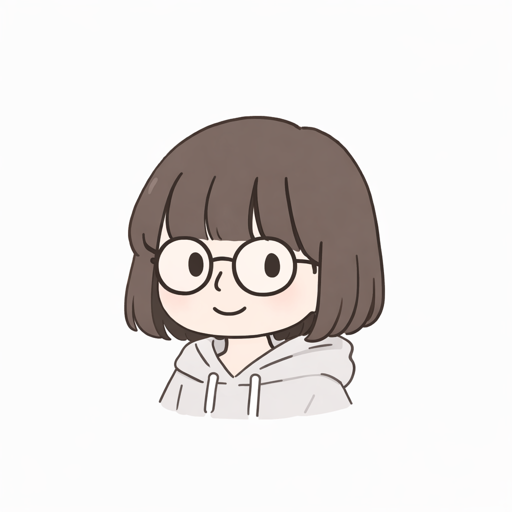

<!DOCTYPE html>

<html lang="ko">
<head>
<meta charset="UTF-8">
<title>Narin</title>

</head>

<body>

<nav>
<a href="#home">Home</a>
<a href="#about">자기소개</a>
<a href="#personality">성격</a>
<a href="#favorites">관심사</a>
</nav>

<section id="home">

<h1>안녕하세요, 나린입니다.</h1>

디자인과 영상 편집, 그리고 웹사이트 만드는 것을 좋아하는 학생입니다.

Editing

Web Design

Minimal Style

</section>

<section id="about">

<h2>자기소개</h2>

저는 평소에 깔끔하고 미니멀한 스타일의 디자인을 좋아합니다. 화려하거나 복잡한 디자인보다는 정리된 느낌의 화면을 더 선호하는 편입니다. 그래서 웹사이트를 보거나 앱 디자인을 볼 때도 색감이나 배치, 글자 크기 같은 요소들을 자연스럽게 유심히 보는 편입니다. 어릴 때부터 영상 편집에도 관심이 있어서 혼자 여러 가지 편집을 해 보면서 배우기도 했고, 무언가를 직접 만들어 보는 과정 자체를 재미있게 느끼는 편입니다. 특히 디지털 작업은 조금씩 수정하면서 결과물이 발전하는 과정이 눈에 보이기 때문에 더 흥미롭게 느껴집니다. 최근에는 직접 웹사이트를 만들어 보면서 HTML이나 구조를 이해하는 것에도 관심이 생겼고, 이런 경험들이 앞으로 디자인이나 제작 활동을 하는 데 도움이 될 것 같다고 생각합니다.

</section>

<section id="personality">

<h2>성격</h2>

저는 보통 차분한 편이지만 관심 있는 분야가 생기면 집중하는 편입니다. 무언가 궁금한 것이 생기면 바로 찾아보거나 직접 해보면서 이해하려는 성향이 있습니다. 그래서 새로운 프로그램을 배우거나 웹사이트를 직접 만들어 보는 것처럼 스스로 시도해 보는 활동을 좋아합니다. 친구들 사이에서는 공감도 잘 하는 편이지만 상황을 정리해서 이야기하는 편이라 가끔은 생각이 현실적이라는 이야기를 듣기도 합니다. 감정적인 판단보다는 실제로 도움이 되는 방법이 무엇인지 생각하는 편이고, 문제를 해결할 때도 여러 가지 방법을 비교하면서 결정하려고 합니다.

</section>

<section id="favorites">

<h2>관심사</h2>

제가 좋아하는 것 중 하나는 디자인을 보는 것입니다. 특히 미니멀한 웹 디자인이나 깔끔한 사용자 인터페이스를 보면 어떻게 만들어졌을지 궁금해지는 편입니다. 그래서 마음에 드는 사이트를 발견하면 색감이나 배치, 폰트 크기 같은 요소들을 유심히 보기도 합니다. 영상 편집도 좋아해서 간단한 편집 작업을 하기도 하고, 이런 경험들이 디자인 감각을 키우는 데 도움이 된다고 생각합니다. 앞으로도 웹 디자인이나 디지털 제작 활동을 통해 새로운 것을 계속 배우고 경험해 보고 싶습니다.

</section>

<footer>
© 2026 Narin
</footer>

</body>
</html>
